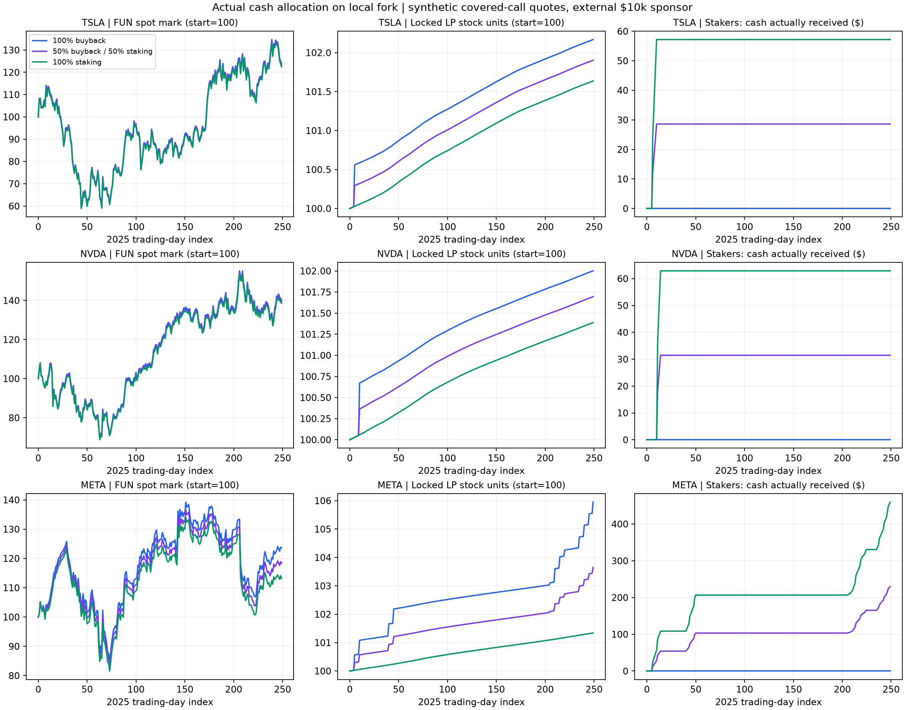

# 全策略、LP 回购与 FUN 质押收益验证（2026-10-03）

本轮补齐了上一轮只扫描一种现货策略参数的缺口：2025 年 TSLA、NVDA、META，按日运行 **51 组现货策略 + 20 组期权/Earn + 9 组回购/质押比例**，合计 **20,000 条日末记录**。已实现用户选择的“质押 FUN 领取实际转入的 USDG 收益”实验模块，并实际执行资金转入、流式计提、领取、退出与异常路径。全部为本地 EVM 或固定测试网状态的本地 fork；没有部署新公网合约或更改现有参数。

**覆盖完整并不等于所有策略盈利，也不等于现有线上 FUN 已支持分红。** 现有 treasury、Earn 与质押仍有产品接入边界，详见下方。

## 代码与覆盖

| 范围 | 本轮检验 | 执行与边界 |
|---|---|---|
| All-in 分批止盈/止损/回补 | 实际 kind0；5% 配置；LP 开/关 | 固定区块已部署 bytecode |
| 纯回购 | book→buyback，LP 开/关 | 候选创建代码本地注册；可使用初始股票本金，不能称利润回购 |
| 固定金额再平衡 | 70% 国库股票目标、5% band、$1k 单次/每日；payout 0/50% | 候选本地注册，实际买卖 |
| NAV 百分比再平衡 | 同目标/band、5% 资产单次/每日；payout 0/50% | 动态限额真实执行；含 LP 的资产基数 |
| Cycle 循环策略 | 5% 恢复买入、止盈/止损/回补、LP 开/关 | 导入 PR12 候选；发生实际恢复买入 |
| Covered call | legacy NetShare、Earn 严格 Physical、只将保费复投 | 实际 desk/vault；合成报价/feed |
| Wheel | call→现金担保 put→持股→call；25/50/100bps 保费敏感性 | 锁真实现金/股票；不是只计算数学收益 |
| 失败情景 | 不成交、不行权、冻结资产、欠款、赎回、买方缺钱、重复抵押 | 不行权为压力情景，不能作为正常收益推荐 |
| FUN 质押分配 | 回购/分红 100/0、50/50、0/100；三股共9组 | 独立 $10k sponsor 的已结算收入；真实 V3/V4 买入销毁及 staking transfer/claim |

PR8 的 CoveredCallDesk 由 PR15 的固定版本引入；Cycle/base 扩展取 PR12，Earn/Physical/Put/adapter 取 PR15。完整来源和 SHA 在 [import-provenance.json](../deploy/all-strategy-income-2026-10-03/import-provenance.json)。只替换两份既有生产源码的最小 Cycle 扩展；新增模块、测试与证据在当前分支。**没有自动合并 PR8/12/15。** 其他未枚举策略、所有参数排列、真实历史期权链、生产环境安全不在本轮通过声明内。

## 币价、资产和 LP 是三个不同结果

以下是 LP harvest 开启的年度结果；括号内为基金外部资产变化，FUN 使用 V4 边际美元标价，不能当成全部持仓可兑现回报。

| 策略 | TSLA FUN / 外部资产 | NVDA FUN / 外部资产 | META FUN / 外部资产 |
|---|---:|---:|---:|
| 同流量只收费用 | +22.49% / +26.21% | +38.61% / +42.21% | +13.13% / +15.96% |
| All-in 5% | +46.78% / +20.67% | +48.07% / +20.37% | +36.93% / +16.13% |
| Cycle 5% | +75.39% / +24.06% | +53.25% / +20.82% | +41.04% / +16.96% |
| NAV 再平衡，payout=0 | +22.49% / +27.38% | +38.61% / +38.01% | +13.13% / +15.07% |
| 纯回购 | +437.49% / +26.22% | +500.04% / +42.22% | +388.36% / +15.97% |

纯回购最能说明差别：国库股票本金移入自己的永久锁定 LP，FUN 供应减少、边际价格升高；外部资产没有凭空增加。三股该场景年末国库股票均为零。它不是约 4–5 倍的外部资产收益，也不形成同额可分红现金。

LP harvest 领取已归属的股票费用并销毁 FUN 费用，瞬时资产守恒；随后回购增加池内股票、减少池内 FUN。外部交易生成的 LP 费用、自回购费用、税费转换费用分账。固定的 $100/日模拟交易负载会让外部交易者损失约 $1.6k–$1.75k/年；这部分收入不能包装成股票策略 alpha。

Cycle 在 TSLA/NVDA/META 分别出现 6/2/1 次恢复买入。该一年样本中 Cycle 的标价结果较高，但 NVDA 的外部资产表现明显低于同流量 fee-only；ticker、路径、阈值和费用都影响结果，不能仅凭一个币价排行榜推荐策略。

完整 51 组参数、状态和 LP 差值：[现货报告](ALL_STRATEGY_SPOT_REPLAY_2026_10_03.md)。

## Covered call / Wheel 的结论

50bps/7自然日的**假设报价**下，期末所有义务已经终止后的 writer 资产变化：

| 股票 | NetShare call | Physical call，交割后留现金 | Wheel |
|---|---:|---:|---:|
| TSLA | −11.12% | +10.37% | −12.90% |
| NVDA | +9.34% | −6.34% | −2.33% |
| META | +11.68% | +8.97% | −3.11% |

三种股票的 Wheel 都收到了保费，但整个持仓全年亏损。META Wheel 期权腿净损益 +$325.94，整体仍 −3.11%，说明“期权赚了保费”不能替代整体资产核算。TSLA Wheel 报价假设 25/50/100bps 对应 −23.91%/−12.90%/+14.17%，结果对无法从股票日线验证的期权报价高度敏感。

期权年度实验限制单张不超过 9 自然日，符合 Earn 的 MAX_TENOR；独立 sponsor 的 legacy NetShare 分红实验固定 5 个交易观察点，有些跨假日期间达 10 天。两者重开仓日和行权价路径不同。TSLA 不分配前的 sponsor 期末资产因此约 $6,376.84，与期权表的 $8,888.27 不同；再扣年内真实分配 $57.19 后是 $6,319.64。**不能将这段差距归因于分红或质押。** 可复现的逐期差异分解随期权报告归档。

Earn 本身是股票/USDG 份额产品，没有 FUN/V4 LP；其 adapter 复投使用真实合约接固定价格 MockPool。只有下面的明确 sponsor 桥接实验使用真实测试网 V3/V4 状态。详见 [期权/Earn 报告](OPTIONS_YEARLY_REPLAY_2026_10_03.md)。

## 质押 FUN：真实现金与回购比例对照

实验起始资本为基金 $20k（国库股票 $10k + LP 股票 $10k），另加独立 sponsor 股票 $10k，产品合计约 **$30k**。买方一次预资 $100k USDG，实际向 sponsor 支付保费。三臂的 sponsor 条款、历史路径、可分配金额完全相同，仅改变这笔金额的去向。

每次期权完成、抵押全部释放后，先累计 `已付保费 − 实际交付股票的原始成本`。可分配额为：

```text
min(
  max(累计已实现净收入 − 累计已分配, 0),
  可用现金,
  max(当前已结算资产净值 − 初始 sponsor 本金, 0)
)
```

这是已结算组合的成本账，不等同于“保费−到期 intrinsic”的期权腿损益。损失结转不重置。门槛限制当时的分配，无法保证未来股票不亏，也不会追回已发放的钱。

| 股票 | 年内通过门槛并分配 | 年末累计已实现组合净收入 | 原因/含义 |
|---|---:|---:|---|
| TSLA | $57.19 | −$4,392.12 | 早期一次合格，之后累计亏损阻止继续分配 |
| NVDA | $62.92 | −$1,707.43 | 同样不能把年内派息称为全年净利润 |
| META | $504.19 | +$504.19 | 多期满足门槛，按所选比例分配 |

META 对照最清楚；其他六组结果在 [summary.json](../deploy/all-strategy-income-2026-10-03/income/summary.json)：

| 分配方案 | FUN 美元标价变化 | LP 股票数量变化 | 已实际领取 USDG | 年末奖励池仍保留 USDG |
|---|---:|---:|---:|---:|
| 全回购 | +23.65% | +5.95% | $0 | $0 |
| 回购/质押各半 | +18.33% | +3.65% | $229.85 | $22.24 |
| 全质押分红 | +13.13% | +1.34% | $459.71 | $44.48 |

回购偏向价格和池内股票；现金分红偏向用户已经收到的 USDG。全质押行并不是“少掉了 $44.48”，这部分尚在 7 日流式发放中，仍计为产品外部资产。三臂期末产品外部资产加已领现金的变化约 +15.07%/+15.05%/+15.02%；不能把单独 FUN 标价变化相加成产品回报。



## 质押模块与前端接入边界

[FunStakingIncome.sol](../src/experimental/FunStakingIncome.sol) 是实验性独立合约：FUN 本金与 USDG 奖励分开，实际入账后才计提；7 日锁定/7 日流式发放；每次增加自己的本金重置自身锁定期；没有代他人质押入口。奖励转账失败不会阻止锁期后的 FUN 本金退出。收入源不可更换、无管理员提走本金入口。拒绝转账扣费资产，保留舍入尘埃。

合约只保证实际资金与时间分摊，**不自行证明收入来自策略利润**。完整产品仍需部署一个可验证来源适配器，在合约中执行累计补亏、抵押释放、净贡献资本与现金门槛；本轮这些规则由测试 sponsor 执行并独立重算。不能仅把一个 owner EOA 设成 incomeSource 就向用户宣称“自动策略分红”。现有 FUN treasury 没有供任意外部 desk 提取本金的通用接口；永久锁定 LP 也不能拿去抵押卖 call。

前端可以据此准备：

1. 明确策略产品类型、收益来源、ticker、参数与部署/实验状态；Earn 份额不能当 FUN。
2. FUN staking 的 approve/stake、当前本金、unlockAt、earned、claim、withdraw，奖励和本金独立展示；增加质押会重置锁期。
3. 显示“累计实际派发、已领取、池内待释放、累计已实现亏损、当前暂停分配原因”；保费收入和可分红收入分别显示。
4. 回购比例、质押比例与分配基数分别显示；本实验为固定 0/50/100%，不宣称现有线上治理可调。
5. 币价图、基金外部资产、LP 本金/费用/锁定、回购烧毁与实际现金回报分开。禁止将 own-LP 自回购费重复计为外部收入。
6. 保留 owner 税费转换、desk allowlist/owner、keeper、calendar/oracle 停机状态；现货 LP harvest permissionless 不等于全部执行链 permissionless。

当前可以联调这些 ABI 和场景；本轮不提供已经部署的新 staking 地址，不把实验标记为可正式开启分红。

冻结的候选 [ABI 与 manifest](../deploy/all-strategy-income-2026-10-03/interfaces/manifest.json) 随证据提交，部署地址明确为 null。Cycle 的 Action 枚举仅追加 `BuyRecovery=5`，0–4 保持原义；前端需要识别新增动作，不能把它当作普通 BuyDip。

## 验证与复现

- 集成离线合约：**1,055 通过 / 0 失败 / 43 明确跳过的 opt-in fork 测试**；跳过不计通过。新的 51+9 fork 年度场景另行显式开启，全部通过；20 期权年度与7项专项在离线总套件内。
- Python：tests 93 项、tools/tests 64 项通过。
- 独立质押 fuzz：3 个固定 seed × 1,024 条 × 96 步、3 用户，共 294,912 随机操作；另有阻断 token、重入、零 TVL、迟到用户、按时权重、小额奖励、退出与舍入检查。
- 独立年度账本重建：现货 12,750 行、期权 5,000 行、分配 2,250 行；另校验导出值与原始日志，不依赖报告器计算。
- Solidity 0.8.26、optimizer runs=1、Cancun；未上调代码大小限制。Cycle runtime 24,514 bytes（余62），EarnVault 24,523（余53），Staking 4,583。前两者剩余空间很小，后续源码变化必须重跑 sizes。
- 现货初次执行曾因 RPC timeout/500 失败；保留失败日志，之后相同冻结代码51组一次干净通过，没有拼接成功片段。集成时缺失 Cycle 原测试夹具已按同一 upstream commit 补齐；Foundry/工具 PATH 环境问题也保留在尝试记录。

```sh
cd contractV2
forge build --sizes
forge test --offline
python3 -m unittest discover -s tests -p 'test_*.py'
python3 -m unittest discover -s tools/tests -p 'test_*.py'
ALL_STRATEGY_REPLAY=true forge test --offline --threads 2 --match-contract '^AllStrategyHistoricalReplayForkTest$' --gas-limit 4000000000 -vv
ALL_STRATEGY_REPLAY=true forge test --offline --threads 2 --match-contract '^IncomeAllocationForkTest$' --match-test testIncomeAllocation_ --gas-limit 4000000000 -vv
```

fork 测试仅发只读 RPC。参数、命令、冻结数据/source SHA、完整原始日志和独立 audit 均在 [归档](../deploy/all-strategy-income-2026-10-03/)。数据是 2025-01-02 至12-31首末 Close；不含股票现金股息、盘中路径、真实期权市场报价、gas 或实际用户需求。真实 V3 深度仅取固定测试网区块并保持 active liquidity，不能当作历史深度。这些结论用于机制验证与产品取舍，不是预期收益承诺或最优参数证明。
