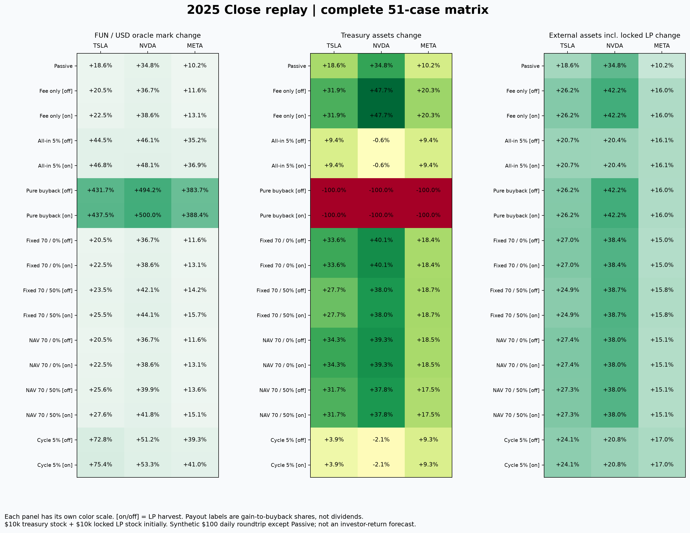
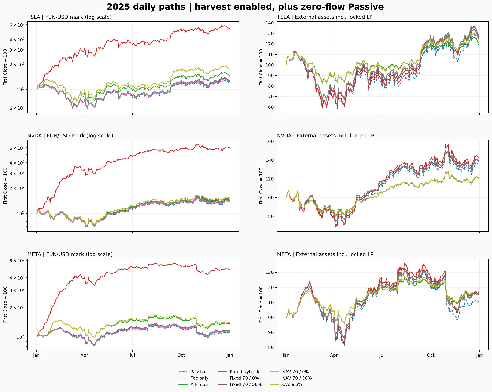
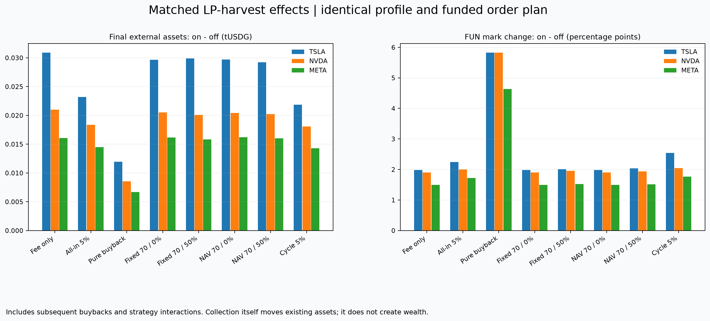
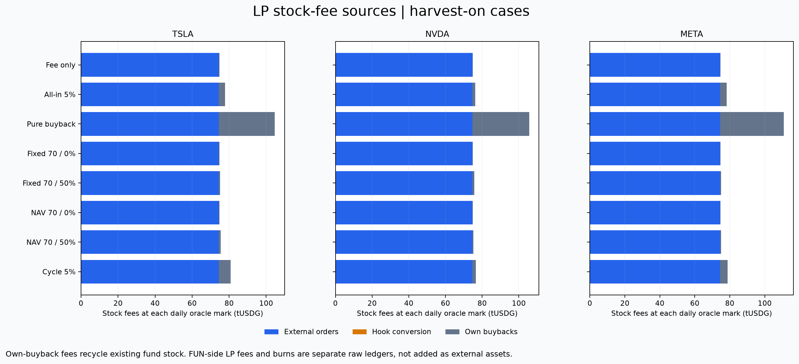

# 2025 全现货策略与 LP 费用回放

51/51 个真实合约本地 fork 实验通过，12,750 个日末快照、408 笔实际 V3 深度报价；没有公共交易。

范围覆盖：部署中的 kind0 All-in、候选纯回购、固定金额再平衡、NAV 百分比再平衡和 PR12 Cycle。每种都与 LP harvest 开关配对；保留零流量 baseline 与同流量 fee-only 控制。

| Profile | 每日策略 | 参数 |
|---|---|---|
| All-in / Cycle | 最多一次 execute | TP 5%/10%，dip/stop 5%，lot 20%；Cycle 额外允许实售后的 5% 上涨恢复买入 |
| Pure buyback | book + buyback | 全部国库股票进入回购预算，不交易股票、不建立 lot |
| Fixed rebalance | 最多一次 execute | 国库 stock target 70%，band 5%，600 秒冷却；$1k/action、$1k/day；payout 0/50% |
| NAV rebalance | 最多一次 execute | 同 target/band/cooldown；5% external-assets/action/day、sellChunk 封顶 $2k；payout 0/50% |

初始资本严格相同：国库股票 $10,000 + 锁仓 LP 股票本金 $10,000。非 baseline 外部交易者一次预资 $100,000，全年 249 次 $100 买入后卖回；这笔交易损失和协议、creator 收入不会伪装成策略利润。发射阶段 gross 股票支出和 25 tUSDG launch fee 在 profile 单列，不作为本表的投资者收益基准。

## 全矩阵与路径





## 实际执行结果

| 股票 | Profile | LP | FUN美元边际标价变化 | 外部资产变化 | 最大日末回撤 | stop/TP/dip/recovery | rebalance买/卖 | 回购 | 外部交易者现金变化 |
|---|---|---|---:|---:|---:|---:|---:|---:|---:|
| TSLA | Passive | off | +18.57% | +18.57% | 48.19% | 0/0/0/0 | 0/0 | 0 | 0 |
| TSLA | Fee only | off | +20.51% | +26.21% | 47.64% | 0/0/0/0 | 0/0 | 0 | -1743.21082 |
| TSLA | Fee only | on | +22.49% | +26.21% | 47.64% | 0/0/0/0 | 0/0 | 249 | -1743.24396 |
| TSLA | All-in 5% | off | +44.54% | +20.67% | 26.04% | 45/73/0/0 | 0/0 | 75 | -1743.887043 |
| TSLA | All-in 5% | on | +46.78% | +20.67% | 26.04% | 45/73/0/0 | 0/0 | 249 | -1743.916681 |
| TSLA | Pure buyback | off | +431.65% | +26.22% | 47.64% | 0/0/0/0 | 0/0 | 249 | -1747.094354 |
| TSLA | Pure buyback | on | +437.49% | +26.22% | 47.64% | 0/0/0/0 | 0/0 | 249 | -1747.106874 |
| TSLA | Fixed 70 / 0% | off | +20.51% | +27.04% | 41.69% | 0/0/0/0 | 4/8 | 0 | -1743.21082 |
| TSLA | Fixed 70 / 0% | on | +22.49% | +27.04% | 41.69% | 0/0/0/0 | 4/8 | 249 | -1743.24396 |
| TSLA | Fixed 70 / 50% | off | +23.48% | +24.85% | 41.82% | 0/0/0/0 | 1/5 | 4 | -1743.288245 |
| TSLA | Fixed 70 / 50% | on | +25.49% | +24.85% | 41.82% | 0/0/0/0 | 1/5 | 249 | -1743.320979 |
| TSLA | NAV 70 / 0% | off | +20.51% | +27.38% | 41.49% | 0/0/0/0 | 4/8 | 0 | -1743.21082 |
| TSLA | NAV 70 / 0% | on | +22.49% | +27.38% | 41.49% | 0/0/0/0 | 4/8 | 249 | -1743.24396 |
| TSLA | NAV 70 / 50% | off | +25.56% | +27.33% | 41.58% | 0/0/0/0 | 4/8 | 6 | -1743.305337 |
| TSLA | NAV 70 / 50% | on | +27.60% | +27.33% | 41.58% | 0/0/0/0 | 4/8 | 249 | -1743.337917 |
| TSLA | Cycle 5% | off | +72.85% | +24.06% | 26.74% | 54/91/0/6 | 0/0 | 94 | -1744.187739 |
| TSLA | Cycle 5% | on | +75.39% | +24.06% | 26.74% | 54/91/0/6 | 0/0 | 249 | -1744.215105 |
| NVDA | Passive | off | +34.84% | +34.84% | 36.89% | 0/0/0/0 | 0/0 | 0 | 0 |
| NVDA | Fee only | off | +36.71% | +42.21% | 35.88% | 0/0/0/0 | 0/0 | 0 | -1628.178946 |
| NVDA | Fee only | on | +38.61% | +42.21% | 35.88% | 0/0/0/0 | 0/0 | 249 | -1628.203045 |
| NVDA | All-in 5% | off | +46.08% | +20.37% | 25.24% | 42/77/2/0 | 0/0 | 77 | -1628.309408 |
| NVDA | All-in 5% | on | +48.07% | +20.37% | 25.24% | 42/77/2/0 | 0/0 | 249 | -1628.332899 |
| NVDA | Pure buyback | off | +494.20% | +42.22% | 35.87% | 0/0/0/0 | 0/0 | 249 | -1631.422729 |
| NVDA | Pure buyback | on | +500.04% | +42.22% | 35.87% | 0/0/0/0 | 0/0 | 249 | -1631.432295 |
| NVDA | Fixed 70 / 0% | off | +36.71% | +38.40% | 31.15% | 0/0/0/0 | 1/6 | 0 | -1628.178946 |
| NVDA | Fixed 70 / 0% | on | +38.61% | +38.40% | 31.15% | 0/0/0/0 | 1/6 | 249 | -1628.203045 |
| NVDA | Fixed 70 / 50% | off | +42.14% | +38.68% | 31.10% | 0/0/0/0 | 1/6 | 5 | -1628.242331 |
| NVDA | Fixed 70 / 50% | on | +44.09% | +38.68% | 31.10% | 0/0/0/0 | 1/6 | 249 | -1628.266084 |
| NVDA | NAV 70 / 0% | off | +36.71% | +38.01% | 31.10% | 0/0/0/0 | 1/5 | 0 | -1628.178946 |
| NVDA | NAV 70 / 0% | on | +38.61% | +38.01% | 31.10% | 0/0/0/0 | 1/5 | 249 | -1628.203045 |
| NVDA | NAV 70 / 50% | off | +39.90% | +38.04% | 31.15% | 0/0/0/0 | 1/5 | 5 | -1628.237113 |
| NVDA | NAV 70 / 50% | on | +41.84% | +38.04% | 31.15% | 0/0/0/0 | 1/5 | 249 | -1628.260936 |
| NVDA | Cycle 5% | off | +51.20% | +20.82% | 25.92% | 43/79/2/2 | 0/0 | 79 | -1628.378717 |
| NVDA | Cycle 5% | on | +53.25% | +20.82% | 25.92% | 43/79/2/2 | 0/0 | 249 | -1628.401747 |
| META | Passive | off | +10.15% | +10.15% | 34.21% | 0/0/0/0 | 0/0 | 0 | 0 |
| META | Fee only | off | +11.63% | +15.96% | 33.53% | 0/0/0/0 | 0/0 | 0 | -1744.698434 |
| META | Fee only | on | +13.13% | +15.96% | 33.53% | 0/0/0/0 | 0/0 | 249 | -1744.720742 |
| META | All-in 5% | off | +35.21% | +16.13% | 18.83% | 36/51/0/0 | 0/0 | 51 | -1745.265668 |
| META | All-in 5% | on | +36.93% | +16.13% | 18.83% | 36/51/0/0 | 0/0 | 249 | -1745.285679 |
| META | Pure buyback | off | +383.73% | +15.97% | 33.53% | 0/0/0/0 | 0/0 | 249 | -1747.836617 |
| META | Pure buyback | on | +388.36% | +15.97% | 33.53% | 0/0/0/0 | 0/0 | 249 | -1747.84582 |
| META | Fixed 70 / 0% | off | +11.63% | +15.00% | 29.29% | 0/0/0/0 | 0/4 | 0 | -1744.698434 |
| META | Fixed 70 / 0% | on | +13.13% | +15.00% | 29.29% | 0/0/0/0 | 0/4 | 249 | -1744.720742 |
| META | Fixed 70 / 50% | off | +14.22% | +15.81% | 28.83% | 0/0/0/0 | 1/5 | 5 | -1744.762997 |
| META | Fixed 70 / 50% | on | +15.74% | +15.81% | 28.83% | 0/0/0/0 | 1/5 | 249 | -1744.78502 |
| META | NAV 70 / 0% | off | +11.63% | +15.07% | 29.17% | 0/0/0/0 | 0/4 | 0 | -1744.698434 |
| META | NAV 70 / 0% | on | +13.13% | +15.07% | 29.17% | 0/0/0/0 | 0/4 | 249 | -1744.720742 |
| META | NAV 70 / 50% | off | +13.59% | +15.05% | 29.23% | 0/0/0/0 | 0/4 | 4 | -1744.741591 |
| META | NAV 70 / 50% | on | +15.11% | +15.05% | 29.23% | 0/0/0/0 | 0/4 | 249 | -1744.763685 |
| META | Cycle 5% | off | +39.28% | +16.96% | 18.83% | 36/57/0/1 | 0/0 | 57 | -1745.317207 |
| META | Cycle 5% | on | +41.04% | +16.96% | 18.83% | 36/57/0/1 | 0/0 | 249 | -1745.336901 |

## 可解释的真实效果

- TSLA Cycle harvest-on 实际执行 6 次恢复买入；纯回购 249 次，回购股票按成交日 oracle 合计 10072.945292 tUSDG。
- NVDA Cycle harvest-on 实际执行 2 次恢复买入；纯回购 249 次，回购股票按成交日 oracle 合计 10348.04917 tUSDG。
- META Cycle harvest-on 实际执行 1 次恢复买入；纯回购 249 次，回购股票按成交日 oracle 合计 12122.173823 tUSDG。

纯回购 harvest-on 三股期末国库均为零，资金已移入锁仓 LP；FUN 美元边际标价分别大涨，不能据此认定可兑现收益同幅增长。LP 收集瞬时外部资产守恒；自身回购也只是把股票从国库转入自有 LP。FUN 标价与销毁量可显著变化，而外部资产变化可能很小。因此需要同时看国库、LP、未领费用和外部交易者账本。





## 计价、资本与执行边界

- 价格窗口为 2025-01-02 首个 Close 至 2025-12-31 最后 Close；不是上年末到当年末的标准年度收益。股票筛选使用同年数据，属于样本内机制实验。
- 真实 Yahoo 日线 Close 已按拆股口径调整；NVDA/META 的现金分红没有注入本实验。开盘时间戳不当作收盘可得时间；仅用日期和历日秒数。
- 固定 Robinhood 测试网区块 128172359、真实 V3/V4 与 deployed factory/registry；kind0 使用既有 runtime，其余为本地 fork 新注册的候选源码。不是公开部署或生产认可。
- 本地授权 market maker 将原 V3 LP 区间拓宽，保留每股原 active liquidity，每日逐次断言相等。它不是历史深度；各股票 L 与费率不同，跨股票差异不能全归因于价格或策略。
- 各组开局国库股票和锁仓 LP 股票本金各 $10,000；固定 40% sale / 50% LP 配置。每组重置，匹配 harvest 开关的地址、初始余额与订单相同。
- 非 baseline 组用独立钱包一次预资 100,000 tUSDG，每个非首日真实花 100 tUSDG 买 FUN 并卖回净收到的全部 FUN，共 249 轮。无每日补资；这是假设交易负载，不是历史 FUN 需求。
- 相同流量的 fee-only 对照保留税费结算与 buyback 机会，但不 execute。无流量 baseline 不能用来单独证明策略 alpha；模拟交易者的损失是必须单列的资金来源。
- 每天顺序为外部交易、hook sweep、owner 有界转换 FUN 税、再次 sweep、可选 LP harvest、最多一次策略 execute 和一次 buyback。纯回购改为 permissionless book 后 buyback，不调用不支持的 execute。
- 转换使用本地 snapshot 实际报价的 99% min-out、300 秒 deadline、50bps sqrt-price limit；不是无滑点成交。LP 收集 permissionless，税费转换依赖 owner；两者不可混称。
- 70% 目标只针对可交易国库 stock+cash，不包括 LP 或回购预算。国库 $10k、LP 股票 $10k 时，国库 70/30 约等于基金整体 85% 股票敞口。
- 固定金额引擎每次与每日上限均 $1,000；NAV 引擎均为当前 external-assets 的 5%，初始同为 $1,000，再受 sellChunk $2,000 限制。payout 0/50% 表示卖出收益留作现金或半数转为股票回购预算，不是持有人分红。
- 外部资产 = 国库 USDG + 国库股票 + 锁仓 LP 股票本金 + 未领 LP 股票费的 oracle mark；不计自身发行 FUN，不计未转换 hook FUN 或未领取的初始 curve fees。锁仓资产不是可赎回 NAV。
- LP harvest 只重分类已拥有费用并烧毁收取的 FUN；回购把自有股票转入自有 LP，瞬时外部资产守恒。外部订单费、税费转换生成的 LP 费、自回购生成的 LP 费分别记录；后者不是新增外部收入。
- FUN/股票来自真实 V4 边际价格，FUN/美元使用历史 Close oracle mark；另保留成交后的实际 V3 spot mark。边际标价不是可兑现持仓总收益。
- 模拟市场始终 open，每次外生股票价格变化后等待 601 秒；每天仅一个策略机会，不保证清完所有到期 lot。未建模盘中路径、MEV、历史深度/订单量、真实 gas 账单；estimatedActionGas 是累计本地 harness 估计。

## 证据与复跑

- 本报告仅包含现货策略与 LP；期权、earn 和 FUN 质押分配属于独立实验，不混入这51组。
- 归档：`contractV2/deploy/all-strategy-income-2026-10-03/spot/`；`results.json` 含51组汇总、实际注册ID/codehash/config、匹配差值和深度报价。
- `daily.jsonl.gz` 保存全部每日原始字段及派生计价；大整数为十进制字符串。`forge.log.gz` 是单次干净51组原始输出，失败尝试不拼装。
- `compiled-source-manifest.json` 绑定测试源码、40个本地依赖、输入数据与命令。`independent-review.json` 是另一个 agent 独立整数/Decimal 审计。
- 图表在 `charts/`；`SHA256SUMS` 覆盖归档。筛选数据和之前kind0参数扫描保留原档案，不被本轮覆盖。

```sh
cd contractV2
ALL_STRATEGY_REPLAY=true ALL_STRATEGY_DAYS=250 ../.local/bin/forge test --offline --fork-url https://robinhood-testnet.drpc.org --fork-block-number 128172359 --gas-price 0 --gas-limit 4000000000 --threads 2 --fork-retries 5 --fork-retry-backoff 1000 --match-contract '^AllStrategyHistoricalReplayForkTest$' -vv
python3 tools/all_strategy_history_report.py  # 图表依赖 matplotlib；可加 --no-charts 仅导出数据
```
