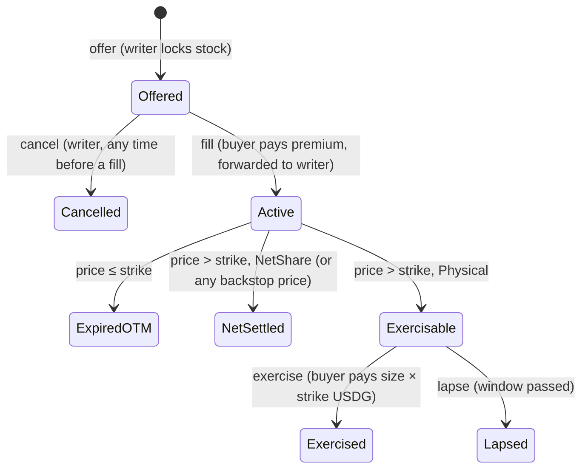

# Covered-call desk

`src/options/CoveredCallDesk.sol` lets a treasury sell weekly covered calls on the stock tokens it holds to an
allowlisted market maker after an off-chain RFQ, with the stock locked on chain for the whole life of the option.
It is the on-chain half of the Wintermute conversation: we send covered-call inventory each week, they quote, we
execute if the price works.

It is a standalone module. It touches no launched strategy, factory or hook. Launched treasuries cannot use it
(they have no withdrawal path, by design); the writer is any address the desk's owner allowlists. Its delayed
backstop can net settle a Physical call. The separate [RHNVDA Earn vault](./EARN_RFQ_LAUNCH.md) uses a new
`PhysicalCallDesk` that requires full strike payment before stock delivery.

## RFQ status: two-step pilot

The first integration is deliberately a two-step, manually coordinated pilot. The market maker returns a quote off
chain; the writer copies the agreed terms into `offer`, and the market maker accepts those exact on-chain terms by
calling `fill`. Until `fill` succeeds, the off-chain quote is not a cryptographically enforceable firm quote and the
writer may cancel the offer.

There is no EIP-712 quote path in this version. Whether a later version should let the writer atomically accept a
market-maker-signed quote depends on the market maker's actual interface: signing wallet versus settlement wallet,
EOA versus ERC-1271, quote transport, nonce/cancellation rules and allowance model. Confirm those requirements with
the first market maker before fixing a signature schema in the contract.

## One option



The price is fixed **once**, by the first of:

| path | who | when | notes |
|---|---|---|---|
| `settle(id, roundId)` / `exercise(id, roundId, to)` | anyone / the buyer | from `expiry + 5 min` | the option's Chainlink feed, at the last round with `updatedAt ≤ expiry`, no older than 26 h. The contract proves it is the last one. For a Physical option, the exercise deadline is fixed at `expiry + SETTLE_DELAY + exerciseWindow`; a late `settle` never creates a fresh window. |
| `proposePrice` + `acceptPrice` | writer ↔ buyer | any time after expiry | a proposal lives 24 h and can be withdrawn. If the **writer** accepts, a Physical buyer gets 3 days to exercise, since the writer chose when the clock started. |
| `backstopSettle` | owner | `expiry + 14 days` | trusted. It always settles NetShare-style, so stalling until the backstop earns the buyer no extra optionality. |

Strike and prices are USDG base units (6 decimals) per **whole** stock token. The Robinhood feeds already include the
token's `uiMultiplier`, so a per-token strike is unaffected by dividends and splits. The writer also names the
current `stockMultiplier` in `Terms`, and that value is copied into the option. `offer` and `fill` each check, both
before and after their token transfers, that `oraclePaused()` is false and `uiMultiplier()` still equals the bound
value. A corporate-action transition therefore fails closed instead of letting a stale RFQ cross it.

## Weekly runbook

1. **Mon–Thu, RFQ.** Send Wintermute the inventory: underlying, size, strike, expiry (Friday 16:00 ET), settlement
   mode, fill deadline, and the three live fields the writer must name in `Terms`: the feed address
   (`listings(stock).feed`), exercise window (`exerciseWindow()`, 2 h), and stock multiplier
   (`stock.uiMultiplier()`). They quote a premium.
2. **Offer** (Safe transaction): `stock.approve(desk, size)`, then `desk.offer(terms)` with `buyer` = their address
   and `premium` = their quote. If the owner changed the listing or window, or the stock became oracle-paused or
   changed multiplier, `offer` reverts instead of silently writing different terms. The stock checks run on both
   sides of the collateral transfer.
3. **Fill.** They call `fill(id)` before `fillDeadline`, and the premium lands in the treasury in the same transaction.
   `fill` repeats the pause and bound-multiplier checks before and after the USDG transfer. A failed check reverts the
   whole fill. If they don't fill, `cancel(id)` returns the stock.
4. **Friday after 16:05 ET, settle.** `python3 tools/cc_round_at.py <feed> <expiry>` prints the round id; anyone
   calls `settle(id, roundId)`. For an oracle-priced Physical option in the money, the buyer must exercise before
   `expiry + 5 min + exerciseWindow` (18:05 ET with the default 2 h window), regardless of when `settle` was called;
   anyone may call `lapse` after that fixed deadline.

## Term sheet fields for the market maker

| field | value |
|---|---|
| style | European, fully collateralised in the stock token, locked on chain at `offer` |
| premium | USDG, paid on chain at `fill`, forwarded to the writer atomically |
| RFQ commitment | two-step manual pilot: the off-chain quote is not on-chain firm; the market maker accepts by calling `fill` |
| stock state | `Terms` binds `stockMultiplier`; `offer` and `fill` fail closed before and after transfers if `oraclePaused()` is true or the multiplier differs |
| settlement price | the option's Chainlink `RH<TICKER> / USD` round current at expiry, per token (multiplier included), USD = USDG |
| settlement | Physical (for an oracle price, pay `size × strike` USDG by the fixed `expiry + 5 min + exerciseWindow` deadline and receive the stock) or NetShare (receive `size × (P − K) / P` of the stock, automatically) |
| fallbacks | bilateral agreed price; owner backstop at +14 days (NetShare) |
| post-fill custody | the stock is in the contract and the premium has reached the writer. A frozen address is credited, not skipped (`owed` → `claim`). Before `fill`, the manually relayed quote carries fill risk. |

## Oracle caveats that matter for pricing

- **The feeds are push feeds with a 0.5% deviation trigger.** The settlement price is the last print before expiry,
  not the official close. On Friday 2026-09-25, NVDA's last print before 16:00 ET was 4 minutes old ($225.66); QQQ's
  was **almost 4 hours old** (16:03 UTC). A QQQ settlement can therefore sit up to ~0.5% away from the close, which
  is more than a week of QQQ premium (~0.24% at 2% OTM). Either the market maker prices that in, the two sides
  settle QQQ/SPY by agreed official close, or a v2 moves to Chainlink Data Streams. Single names update far more
  often.
- **List the standard proxy, never the SVR proxy.** The two share `description()` on this chain; the SVR view hides
  fresh rounds (review finding L1).
- **An expiry inside a closure** (weekend, holiday) has no fresh round, so the oracle refuses it. `offer` refuses
  such an expiry when the calendar is set; the production calendar is `0xFE9E…87F5`.
- **Aggregator switches.** The proxy's switch to a new aggregator is not visible on chain; see the NatSpec on
  `_oraclePrice`.
- **Corporate-action admission is fail-closed.** The RFQ binds the current `uiMultiplier`; both `offer` and `fill`
  check it and `oraclePaused()` before and after moving tokens. This protects trade admission across a pause or
  multiplier transition. The settlement feed already includes the multiplier, so do not multiply its answer again.

## Trust

Nobody can move locked or owed tokens, change an option after `offer`, or stop `cancel` / `settle` / `exercise` /
`lapse` / `claim`. Desk pausing, stock oracle-pausing and a bound-multiplier mismatch stop new `offer`s and `fill`s
only. The owner controls:

- the allowlists;
- listings and the exercise window for **future** offers, which writers must name explicitly;
- `sweep` of tokens nobody is owed;
- the 14-day backstop.

`renounceOwnership` is disabled so the backstop cannot be lost.

## Review record (2026-09-29)

An independent agent reviewed the contract in two rounds. Its proof-of-concept tests are kept as regressions in
`test/CoveredCallDeskAudit.t.sol` and `test/CoveredCallDeskAudit2.t.sol`.

| # | finding | resolution |
|---|---|---|
| H1 | the feed was read from the listing at settlement, so a re-list could re-price or brick live options | feed and decimals copied into the option at `offer` |
| N1 | …and a re-list or window change racing an `offer` was silently adopted | the writer names `feed` and `exerciseWindow` in `Terms`, and `offer` reverts on mismatch |
| M1 | on the agreed path the writer could pick when the buyer's exercise clock started | proposals expire in 24 h and can be withdrawn; a writer-accepted price opens 3 days |
| N2 | the buyer could stall until the backstop and gain a free ~17-day tail | the backstop settles NetShare-style; a buyer-accepted price opens only the option's own window |
| L1 | with a lagged (SVR) feed, two rounds could each pass the proof at different times | `SETTLE_DELAY` = 5 min; the docs say to list the standard proxy |
| L3 | a payout sent to the desk itself became sweepable | `exercise`/`claim` refuse the desk as recipient, and a failed `to` credits the buyer |
| L2, I1 | the backstop can override a provable price; aggregator-switch edge | by design, documented and pinned by tests |

Pre-live hardening on 2026-09-30 additionally bound `stockMultiplier` into `Terms` and each option, made both sides
of the `offer` and `fill` token transfers fail closed on `oraclePaused()` or multiplier drift, and fixed an
oracle-priced Physical option's exercise deadline to `expiry + SETTLE_DELAY + exerciseWindow`. The last change means
the caller who submits `settle` cannot extend the buyer's option by waiting.

This is not a substitute for an external audit. Size the first weeks accordingly.

## Tests

```
forge test --match-path 'test/CoveredCallDesk*.t.sol'                 # unit, regression and fuzz suites
RH_FORK=1 forge test --match-path test/CoveredCallDeskFork.t.sol       # 5 against live NVDA, USDG, feed, calendar
```

The fork test proves the round logic against the real RHNVDA / USD history. For Friday 2026-09-25 it accepts round
1106 at $225.660187, refuses round 1105 as not the last, and refuses round 1107 as after expiry. It also runs a full
offer → fill → exercise cycle with the real NVDA and USDG tokens.

## Separate RHNVDA Earn vault

The [Earn vault](./EARN_RFQ_LAUNCH.md) keeps its own hNVDA shares and RHNVDA/USDG asset ledger. It deploys a new
`PhysicalCallDesk` and `CashSecuredPutDesk` for full-collateral, physical RFQs. This legacy desk remains independent;
its owner-controlled delayed backstop may net settle even a Physical call and must not be configured as the Earn
vault's call desk.
